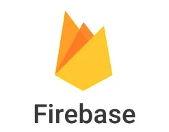
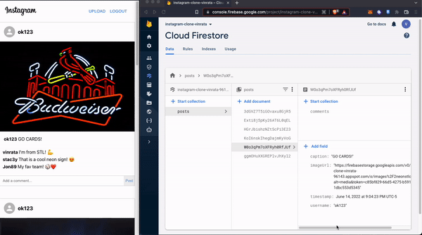

# My Instagram Clone App

This project was made with React and Firebase.
React hooks (useEffect and useState)
 
<h2> ahref="https://instagram-clone-vinrata-96143.web.app/"</h2> 

 

### Comments Stored In Database
Firebase allows for real-time updating in the database everytime a new comment is made on a post.
This GIF shows a new comment being made and the database updates in real-time.

## Full Account Creation 

 

### Image Uploading to database (GIFs work too!)

 

### Fully Functional on Mobile

 
